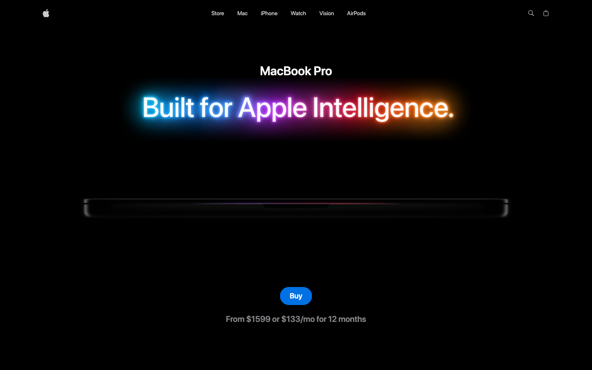

<div align="center">

# MacBook Pro Landing — GSAP + Three.js

A recreation of Apple's MacBook Pro product page, built to learn **Three.js** and **GSAP** from scratch.

**[Live demo →](https://gsap-macbook-landing-iota.vercel.app/)**

<a href="https://gsap-macbook-landing-iota.vercel.app/">
  
</a>

</div>

---

## Why I built this

I wanted to properly learn 3D on the web and scroll-driven animation, so I picked one of the most polished product pages out there and rebuilt it. Copying a page like this meant working through real problems: loading and lighting 3D models, playing video on a 3D screen, and syncing animations to scroll.

## What's in it

- **Interactive 3D MacBook.** Drag to rotate the model, switch between dark and silver finishes, and toggle 14" / 16". The two models slide and fade into place with GSAP.
- **Video on the 3D screen.** Feature videos play as a texture on the laptop's screen and change as you scroll.
- **Scroll-driven storytelling.** GSAP ScrollTrigger pins sections, scrubs timelines, spins the laptop 360°, and reveals feature cards one by one.
- **Hero video, performance gallery, and highlights,** all animated on scroll.
- **Responsive.** The model scale and layout adjust for smaller screens.

## Stack

- **React 19** + **Vite**
- **Three.js** via **React Three Fiber** and **Drei** (models, lighting, controls, video textures)
- **GSAP** + **ScrollTrigger** with `@gsap/react`
- **Tailwind CSS v4**
- **Zustand** for shared state (color, size, current screen video)

## Project layout

```
src/
  components/
    Hero.jsx            Title + hero video
    ProductViewer.jsx   3D viewer with color and size controls
    Showcase.jsx        Pinned, scrubbed video section
    Performance.jsx     Scroll-animated image gallery
    Features.jsx        Rotating laptop + feature cards synced to scroll
    Highlights.jsx      Highlight cards
    three/              Studio lights, 14"/16" model switcher
    models/             MacBook models (generated with gltfjsx)
  store/                Zustand store
  constants/            Page content
public/
  models/               .glb MacBook models
  videos/               Hero and feature videos
```

## Run it locally

```bash
npm install
npm run dev
```

Then open <http://localhost:5173>.

## Credits

- 3D model: [MacBook Pro M3 16 inch 2024](https://sketchfab.com/3d-models/macbook-pro-m3-16-inch-2024-8e34fc2b303144f78490007d91ff57c4) by [jackbaeten](https://sketchfab.com/jackbaeten), licensed [CC BY 4.0](http://creativecommons.org/licenses/by/4.0/).
- Design, copy, and media are from [Apple's MacBook Pro page](https://www.apple.com/macbook-pro/).

## Disclaimer

This is a personal learning project. It is not affiliated with or endorsed by Apple. Apple, MacBook, and related marks belong to Apple Inc.
